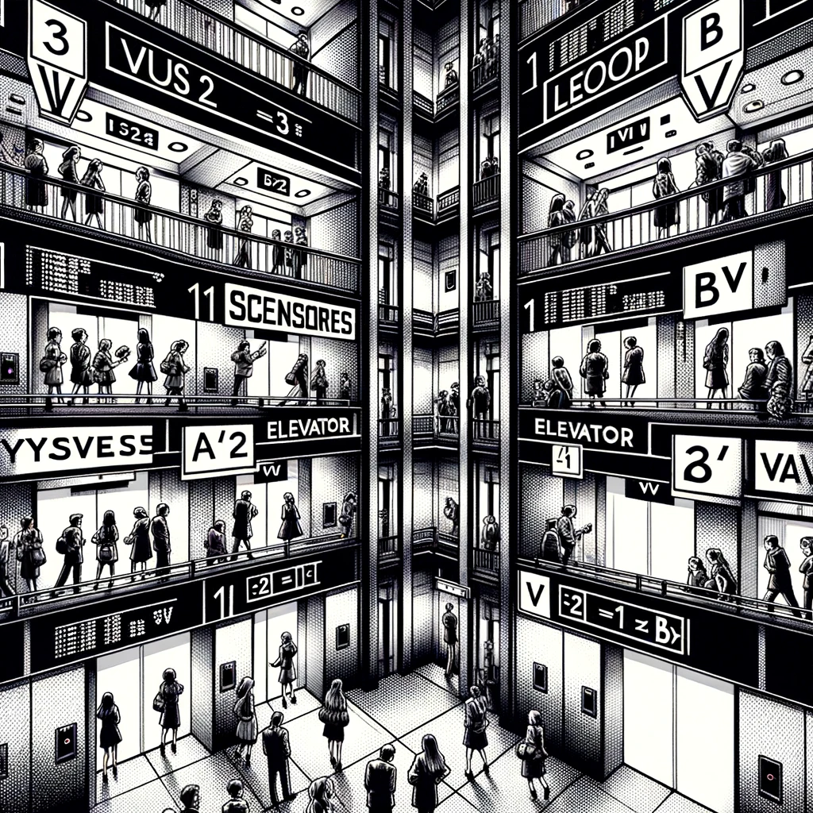

# pyAscensores

Modelar el paso de un día en la U...

```
           Personas                                    Personas
          esperando                                    en la planta

Planta  3    _____     [v4v]    | |     | |     | |     __3__ 
Planta  2    ___2_      | |     | |     | |     | |     __4__
Planta  1    _____      | |     | |    [^2^]    | |     __2__
Planta  B    _____      | |    [^0^]    | |     | |     __4__
Planta -1    _____      | |     | |     | |     | |     __1__
Planta -2    _____      | |     | |     | |    [v1v]    __0__
Planta -3    ___1_      | |     | |     | |     | |     __1__
                       /--------- Ascensores ------/
   
```

## Sobre las personas

- Las personas que llegan a la universidad hacen uso de los ascensores.
- Cada persona que llega sabe a que planta va a ir, cuánto tiempo estará en esa planta, luego de lo cual tendrán que irse.
- Para irse, una persona debe bajar a la planta baja.

## Sobre los ascensores

- Los ascensores tienen una capacidad máxima de 6 personas.
- Si el ascensor está lleno, solo pueden salir las personas que están dentro
  - Salvo que en la planta en la que bajan suba un número igual o menor de personas.

En un momento determinado del tiempo, un ascensor está subiendo, bajando o parado.

Cuando una persona llama a un ascensor, va el que está más cerca y al que le pilla de paso.
